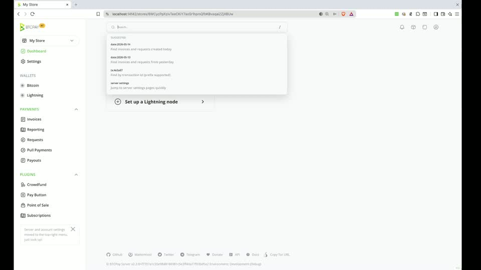

# Global search

Plugins can add navigation shortcuts and searchable records to BTCPay Server's
global search. Use static results for known routes and a remote provider when
results depend on the user's query or application data.

**Video:** [Global search overview](https://github.com/user-attachments/assets/9db609a0-6805-4b77-acf3-839403a84f53)

[](https://github.com/user-attachments/assets/9db609a0-6805-4b77-acf3-839403a84f53)

## Static results

Static results are sent with the page. The browser uses fuzzy search across
their title, category, and aliases to filter them without a server request.
Register an `ActionResultItemViewModel` from the plugin's
`Execute(IServiceCollection)` method:

```csharp
services.AddStaticSearch(new ActionResultItemViewModel
{
    RequiredPolicy = Policies.CanViewStoreSettings,
    Title = "Configure example",
    Action = nameof(UIExampleController.Index),
    Controller = "UIExample",
    Values = context => new { area = Plugin.Area, storeId = context.Store!.Id },
    Category = "Store",
    Aliases = ["Example", "Configure"]
});
```

The route is generated for the current search context. A store-scoped policy
also prevents the result from being created when no store is selected. Set
`RequiredPolicy` for every protected destination; unauthorized results are
removed before the response is returned.

Titles, categories, and aliases registered through `AddStaticSearch` are
included in BTCPay Server's default translation catalog. Use stable source text
for them. Aliases can be individual words or complete sentences that describe
other ways a user might search for the result.

Use the `ResultItemViewModel` overload only when the result already has a URL.
`ActionResultItemViewModel` is preferable for controller actions because its
`Values` callback can include the active store and plugin area.

## Remote results

When browser-side filtering finds no static match, global search sends the
query to the server. Implement `ISearchResultItemProvider` for database-backed
or computed results:

```csharp
public sealed class ExampleSearchProvider(ExampleService examples)
    : ISearchResultItemProvider
{
    public async Task ProvideAsync(
        SearchResultItemProviderContext context,
        CancellationToken cancellationToken)
    {
        if (context.UserQuery is not { Length: > 0 } query ||
            context.Store is null ||
            !await context.IsAuthorized(PluginPolicies.CanViewExample))
            return;

        var limit = context.MaxResult ?? 10;
        foreach (var example in await examples.Search(
                     context.Store.Id, query, limit, cancellationToken))
        {
            context.ItemResults.Add(new ResultItemViewModel
            {
                RequiredPolicy = PluginPolicies.CanViewExample,
                Title = example.Name,
                Category = "Example",
                Url = context.Url.Action(
                    nameof(UIExampleController.View),
                    "UIExample",
                    new { area = Plugin.Area, storeId = context.Store.Id, id = example.Id })
            });
        }
    }
}
```

Register the provider from the plugin:

```csharp
services.AddSearchResultItemProvider<ExampleSearchProvider>();
```

`AddSearchResultItemProvider` registers the provider as a singleton, so its
dependencies must be safe to resolve from a singleton. Respect
`CancellationToken` and `MaxResult`, scope data access to `context.Store` and
`context.UserId`, and authorize before querying protected data. Setting
`RequiredPolicy` on each result provides a final authorization filter but does
not protect a query that has already run.

`UserQuery` is `null` while static results are assembled and contains the user's
text for remote search. A provider may support both modes by branching on that
value. Results with a lower `Order` appear first.
