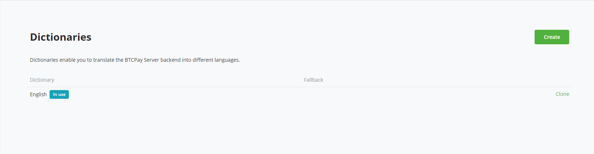
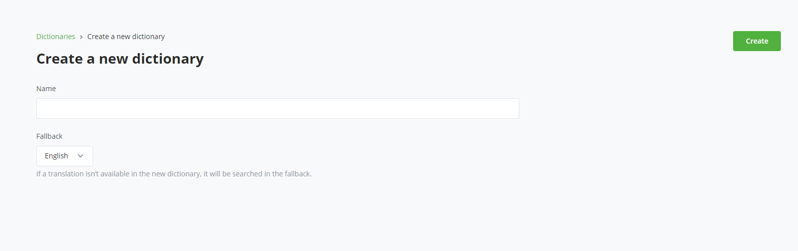
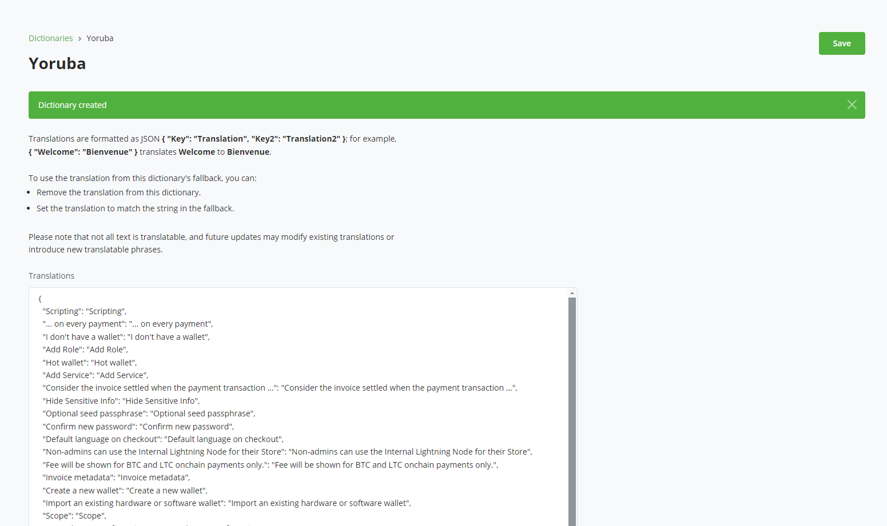
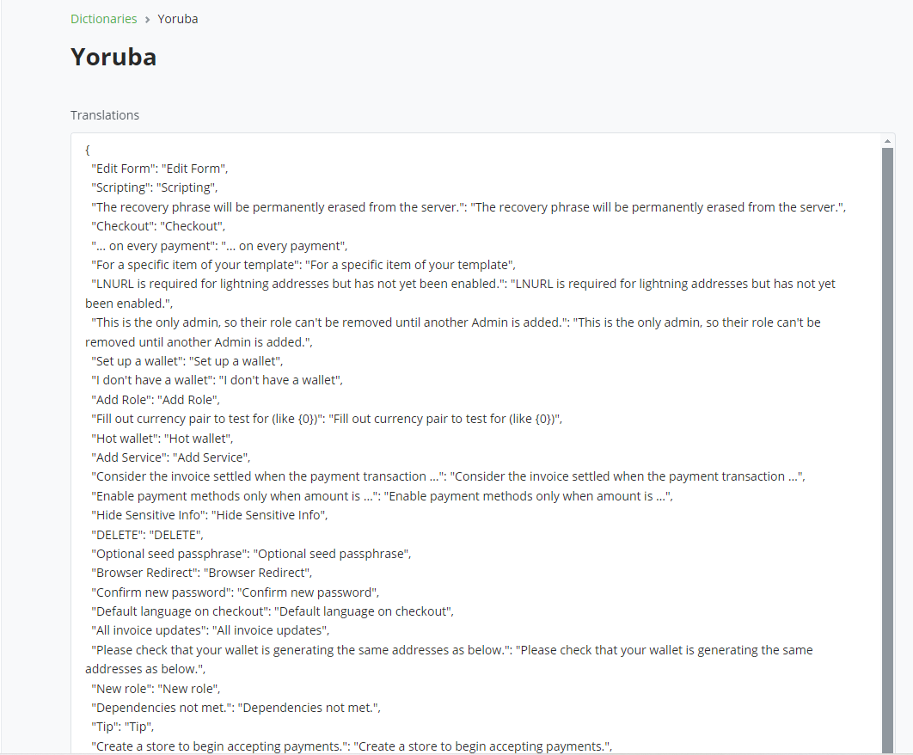
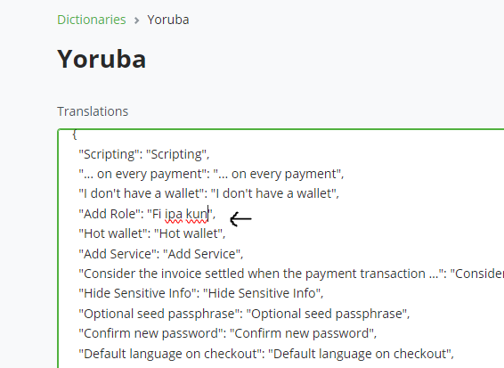
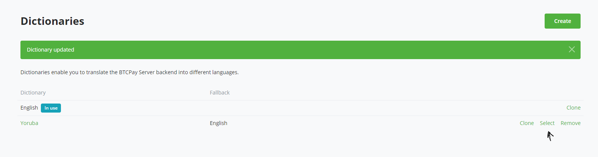
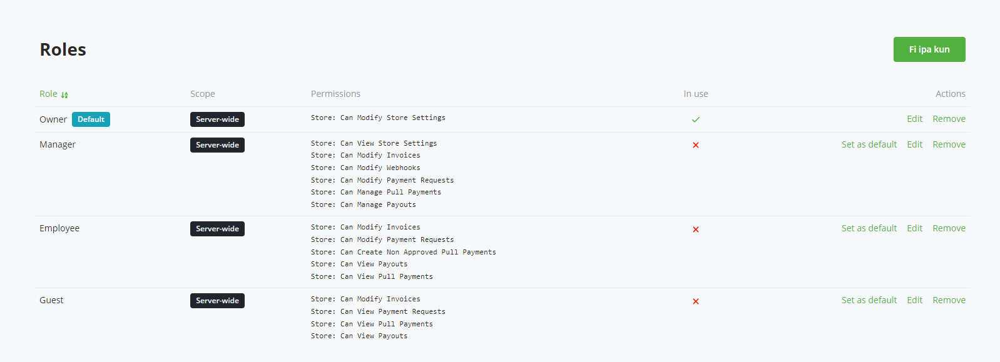

<a id="using-btcpay-translation-feature-to-localize-your-btcpay-server-instance"></a>

# Backend translations

Server administrators can select a server-wide language for the BTCPay Server
interface. This affects the backend and shared account pages, including sign-in
pages. Checkout language settings are separate.

Translations use English as their ultimate fallback. Not every interface string
is translatable, and new releases can introduce untranslated text.

Open **Server Settings > Translations** to manage the installed and available
languages. This page requires server-administrator permission.

Earlier releases called translations **Dictionaries**. The screenshots below
retain that older label and layout; use the current **Translations** labels and
actions described in the text.



## Language packs

Community language packs provide maintained translations without requiring a
server administrator to translate every string.

1. Find the language under **Available to install** and select **Install**.
2. After installation, find it under **Installed languages** and select
   **Select**.
3. Confirm that the language has the **In use** badge and review important
   pages for accuracy.

Selecting a language applies it immediately across the server interface. The
same selection is available as **Backend's language** under **Server Settings >
Policies**.

BTCPay Server fetches the language-pack manifest and files from the
[`btcpayserver-translator`](https://github.com/btcpayserver/btcpayserver-translator)
repository. The server needs outbound HTTPS access to
`raw.githubusercontent.com` to discover, install, and update packs. If that
service is unavailable, the page shows installed languages but cannot list the
available packs.

## Translating BTCPay Server

Create a custom translation when a community pack is unavailable or when the
server needs local wording:

1. Select **Create**.
2. Enter a name and choose an installed fallback language.
3. Select **Create**, then edit the translation JSON.
4. Save the translation and select it from the installed-language list.





To customize a community pack, create a custom translation and choose that pack
as its fallback. Installed community packs cannot be edited directly. This
keeps local overrides separate while allowing non-overridden strings to receive
upstream updates.

The editor stores source strings as keys and translated strings as values:

```json
{
  "Add Role": "Translated text"
}
```





Preserve placeholders such as `{0}` and `{1}`, intentional HTML, and valid JSON
escaping. Invalid JSON produces a syntax error. Removing an override, or making
it equal to its fallback value, causes that string to inherit from the fallback
translation.





## Updating and removing translations

An **Update** action appears when an installed community pack has changed
upstream. Review important workflows after updating because wording and
available source strings can change between releases.

You cannot uninstall the active translation or a translation used as another
translation's fallback. Select another backend language or remove the dependent
custom translation first.

## Tips for effective translations

- Keep terminology consistent across related pages and actions.
- Review placeholders and markup in context instead of translating only the
  surrounding words.
- Test sign-in, navigation, store administration, and server administration
  after a substantial change.
- Review custom translations after BTCPay Server updates because new interface
  strings can fall back to English.
- Contribute generally useful work to
  [`btcpayserver-translator`](https://github.com/btcpayserver/btcpayserver-translator)
  so other operators can install it as a community pack.
