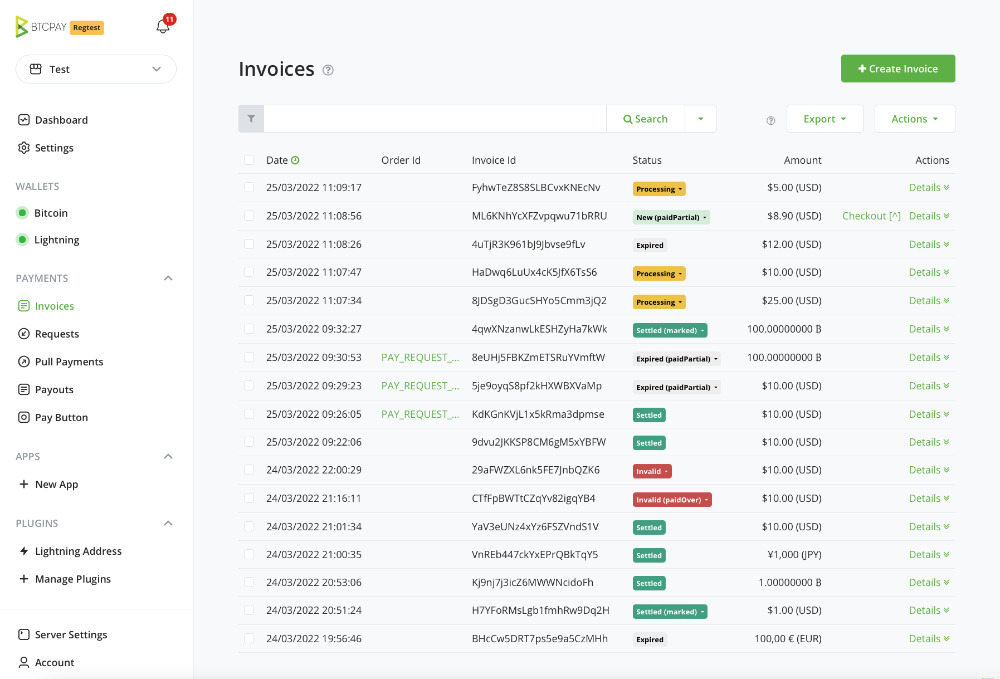
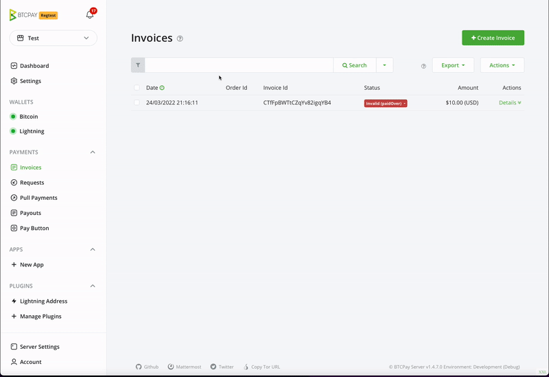

# Invoices

An invoice records a request for payment to a store. It fixes the requested
amount and exchange rate for a limited period, presents the store's available
payment methods at checkout, and tracks the resulting payments.

Open **Payments > Invoices** in the selected store to create an invoice or
review existing ones. Wallet transactions that were not paid through an
invoice appear in the wallet instead.

_Screenshots in this guide may show an earlier layout. Use the current labels
and behavior described in the text._

## Invoice statuses

An invoice has a base status that describes its payment and settlement state:

| Status | Meaning | Typical action |
|---|---|---|
| **New** | The invoice is awaiting full payment and has not expired. | Wait for payment. |
| **Processing** | The invoice is paid in full but is waiting for the payment method's settlement conditions, such as on-chain confirmations. | Wait for settlement. |
| **Settled** | The invoice is paid and its settlement conditions were met. | Fulfill the order according to your business policy. |
| **Expired** | The invoice expired before it was paid in full. | Review any late or partial payment before deciding whether to fulfill or refund. |
| **Invalid** | A fully paid invoice did not meet its settlement conditions within the configured monitoring period. | Verify the payment independently before changing the status or refunding it. |

Lightning payments normally settle without waiting for on-chain confirmations.
Do not fulfill an order merely because an on-chain transaction was broadcast;
use the invoice status and your store's confirmation policy.

The status can also include an exception:

| Exception | Meaning |
|---|---|
| **Paid partial** | The detected payments total less than the requested amount. |
| **Paid over** | The detected payments total more than the requested amount. |
| **Paid late** | Full payment arrived after the invoice expired. The base status remains **Expired** until you take action. |
| **Marked** | A store user manually marked the invoice settled or invalid. This does not prove that a blockchain payment confirmed. |

Review the amount, payment method, transaction, and business context before
manually changing a status. A partial payment can happen when the payer sends
the wrong amount or when a service deducts a fee from the withdrawal.

## Invoice filtering

The invoice list is scoped to the selected store and is ordered by invoice
creation date, newest first. Use its search and filters to narrow the list:

- Search by invoice ID, order ID, buyer email, amount, payment destination, or
  other indexed invoice information.
- Use `orderid:value` or `itemcode:value` for an exact field-oriented search.
- Filter by base status, payment exception, application or plugin, and invoice
  creation date.
- Select **Unusual** to find invalid invoices and invoices with exceptions,
  including manually marked invoices.
- Select **Include archived** to include archived invoices in the results.

Selecting several status or exception filters matches invoices that satisfy
any selected filter. Date ranges apply to invoice creation time, not payment
time.

## Invoice details

Select an invoice ID to inspect its requested amount, checkout information,
payments, metadata, status history, and related events. Available actions
depend on the invoice state and your account permissions. They can include:

- Opening the checkout or receipt.
- Adding a comment for other store users.
- Marking the invoice settled or invalid, or reverting a previous manual mark.
- Issuing a refund.
- Archiving or unarchiving the invoice.

Treat manual status changes as an accounting decision. Verify the underlying
payment before marking an unusual invoice settled.

## Invoice metadata

Apps and integrations can attach metadata such as an order ID, item details,
or buyer information to an invoice. BTCPay Server can display, search, and
include recognized fields in reports. See the developer guide to
[invoice metadata](https://docs.btcpayserver.org/Developers/api/invoice-metadata/) for supported fields,
privacy considerations, and examples.

## Refunding an invoice

When an invoice is eligible, select **Issue Refund** from its details page. A
refund creates a pull payment that lets the customer submit a payout
destination without giving the store custody of that destination in advance.

1. Choose a supported payout method if more than one is available.
2. Select one of the suggested refund amounts or enter a custom amount. Review
   whether the amount uses the original rate, the current rate, or the payment
   currency.
3. Apply an optional deduction only when your refund policy calls for it.
4. Create the refund and give the resulting claim link to the customer.
5. After the customer claims it, review and process the resulting payout.

The invoice details page keeps links to its refunds. If an active refund
already exists, **Issue Refund** opens it instead of creating a duplicate. See
[Pull payments](pull-payments.md) for the claim and payout workflow.

## Archiving invoices

Archiving hides an invoice from the default list. It does not delete the
invoice, change its status, or stop payment monitoring.

Archive one invoice from its details page, or select several invoices in the
list and use the bulk archive action. Enable **Include archived** to display
both active and archived invoices and make the unarchive action available.

A payment to an archived invoice is still detected. Whether it is processing,
settled, partial, or late depends on the amount, timing, and settlement policy,
not on the archive flag.

## Invoice export

From the invoice list, select **Reporting** to open the Invoices report. Choose
the required creation-date range and export the report as CSV.

The report contains invoice, payment, payment-method, rate, fee, and metadata
fields. An invoice with several payments can produce several rows. Plain unpaid
**New** and **Expired** invoices are omitted, while archived invoices with
reportable activity are included.
